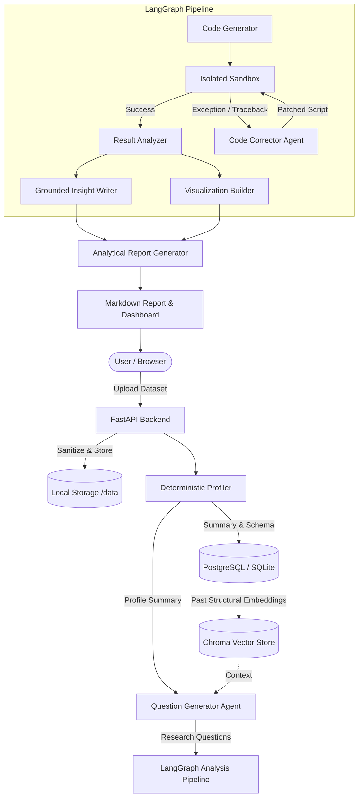

# DataMind: Local-First Autonomous EDA Platform

[](https://opensource.org/licenses/MIT)
[](https://www.python.org/)
[](https://nextjs.org/)
[](https://fastapi.tiangolo.com/)

A production-quality, local-first autonomous exploratory data analysis (EDA) platform inspired directly by the architecture and workflow of **DataMind**.

> **Core Workflow:**
> Upload a CSV / JSON / Excel / Parquet dataset → automatically profile it deterministically → generate useful research questions with LLM → generate Python analysis code → safely execute that code inside an isolated sandbox → automatically capture tracebacks and self-correct failures → extract grounded findings strictly from code execution output → generate visualizations → compile an analytical report.

---

## 1. System Architecture



---

## 2. Core Principles & Philosophy

### Strict Grounding (Zero Hallucinations)
The LLM is strictly prohibited from inventing numerical statistics or trends.
- All metrics (percentages, means, medians, p-values, correlations) originate from deterministic Python execution.
- Code prints structured results via `RESULT_JSON:` tokens to `stdout`.
- The insight agent is constrained to synthesize findings referencing solely verified numbers present in code output.

### Local-First Guarantee
- Datasets never leave the host machine.
- Profiling, sandbox execution, vector embeddings, telemetry, and persistence run 100% locally.
- Only external LLM inference requests exit the machine (supporting OpenRouter, Google Gemini, and fully offline Ollama).

### Self-Correcting Execution Sandbox
- Generated Python scripts run in isolated execution environments with strict resource constraints (timeout limits, memory limits, and no network access).
- When a script encounters an error (e.g. `KeyError`, `TypeError`, `ValueError`, `ZeroDivisionError`), the traceback, code, and schema are returned to the self-correction agent.
- Scripts are autonomously rewritten and retried up to the configurable limit (`MAX_ATTEMPTS = 3`).

---

## 3. Technology Stack

- **Backend:** Python 3.12+, FastAPI, Pydantic v2, SQLAlchemy 2.0, Alembic, Pandas, NumPy, Matplotlib, Seaborn, LangGraph, ChromaDB, Sentence Transformers.
- **Database:** PostgreSQL (with automatic zero-config SQLite / `aiosqlite` local fallback).
- **Frontend:** Next.js 16 (App Router), React 19, TypeScript, Tailwind CSS, Lucide Icons, Recharts.
- **Infrastructure:** Docker Compose, Docker analysis sandbox, WebSocket live updates.

---

## 4. Getting Started

### Prerequisites
- Python 3.12+
- Node.js 18+ (Node 22 recommended)
- Docker Desktop (optional for containerized sandbox/Postgres)

### Backend Setup

1. Navigate to the backend directory and create a virtual environment:
   ```bash
   cd backend
   python -m venv .venv
   # Windows:
   .\.venv\Scripts\activate
   # Linux/macOS:
   source .venv/bin/activate
   ```

2. Install dependencies:
   ```bash
   pip install --upgrade pip setuptools wheel
   pip install -r requirements.txt
   ```

3. Configure environment variables:
   ```bash
   cp .env.example .env
   ```
   *(Optionally provide your `OPENROUTER_API_KEY` or `GOOGLE_API_KEY`. If left blank, DataMind runs in deterministic offline evaluation mode).*

4. Run database migrations:
   ```bash
   alembic upgrade head
   ```

5. Start the backend API server:
   ```bash
   uvicorn app.main:app --host 0.0.0.0 --port 8000 --reload
   ```

### Frontend Setup

1. Navigate to the frontend directory:
   ```bash
   cd frontend
   npm install
   ```

2. Start the development server:
   ```bash
   npm run dev
   ```

3. Open [http://localhost:3000](http://localhost:3000) in your browser.

---

## 5. Automated Test Suite

Run the full end-to-end backend test suite (unit tests, deterministic profiler, sandbox isolation, self-correction loop, local RAG retrieval, and full pipeline):

```bash
cd backend
pytest -v
```

All 18 test cases pass:
- `tests/test_phase2.py`: Upload validation across CSV, JSON, Parquet, and Excel formats.
- `tests/test_phase3.py`: Deterministic profiling, statistics, null counts, and data quality checks.
- `tests/test_phase4.py`: Research question formulation schema validation and offline fallback.
- `tests/test_pipeline.py`: Sandbox execution, timeout handling, traceback capture, failure taxonomy classification, RAG synthetic structural indexing, and autonomous workflow end-to-end.

---

## 6. Failure Taxonomy & Telemetry

DataMind logs every execution trial to `data/logs/trials.jsonl` with structured classifications:
- `timeout`
- `KeyError`
- `TypeError`
- `ValueError`
- `ZeroDivisionError`
- `SyntaxError`
- `malformed JSON`
- `MemoryError`
- `DockerError`

Telemetry enables rigorous benchmarking of model repair efficacy across attempts without requiring manual inspection.
